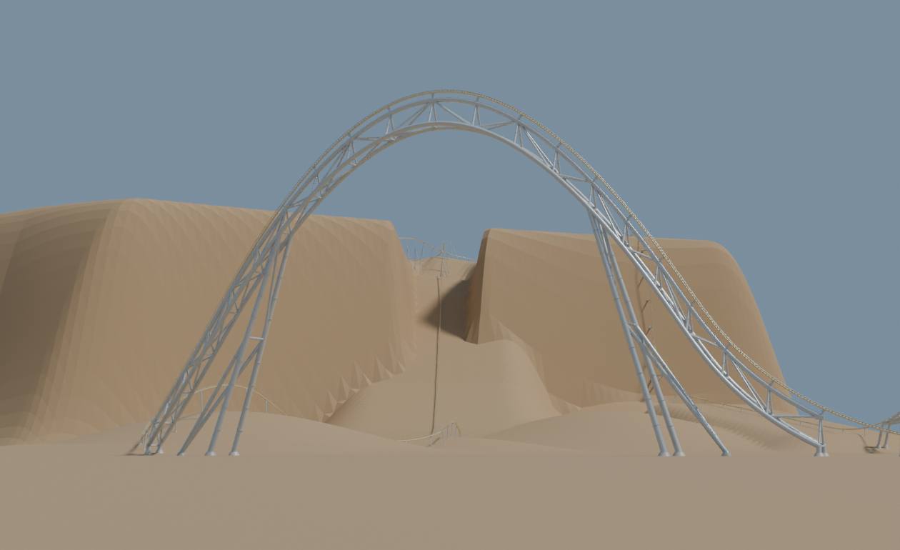
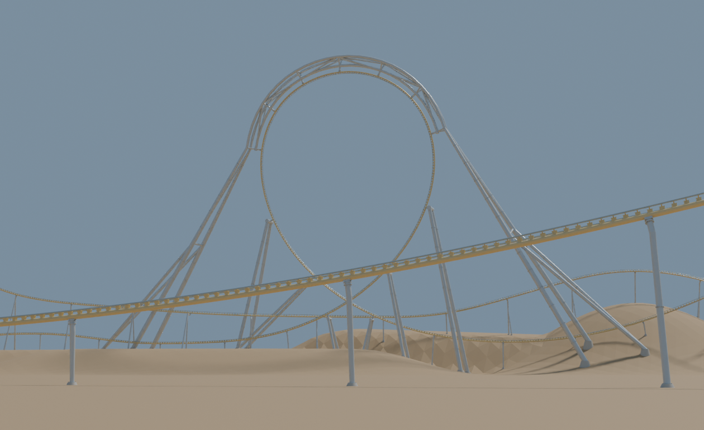
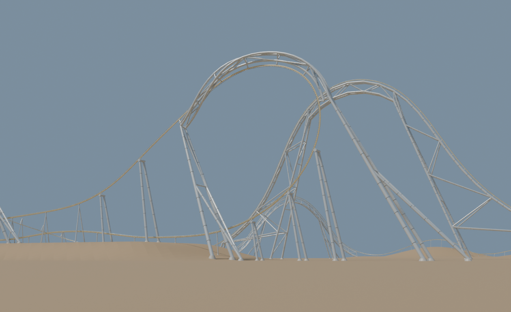
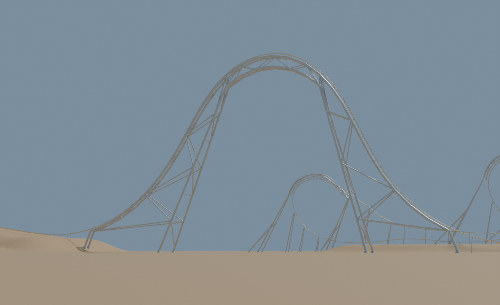
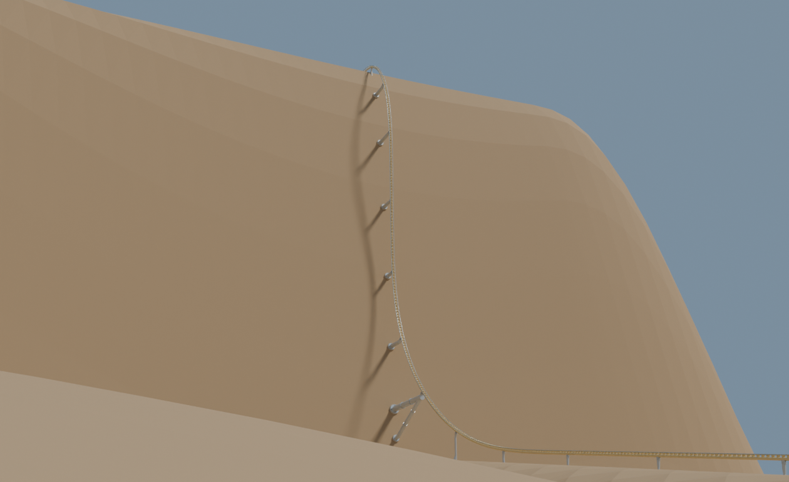
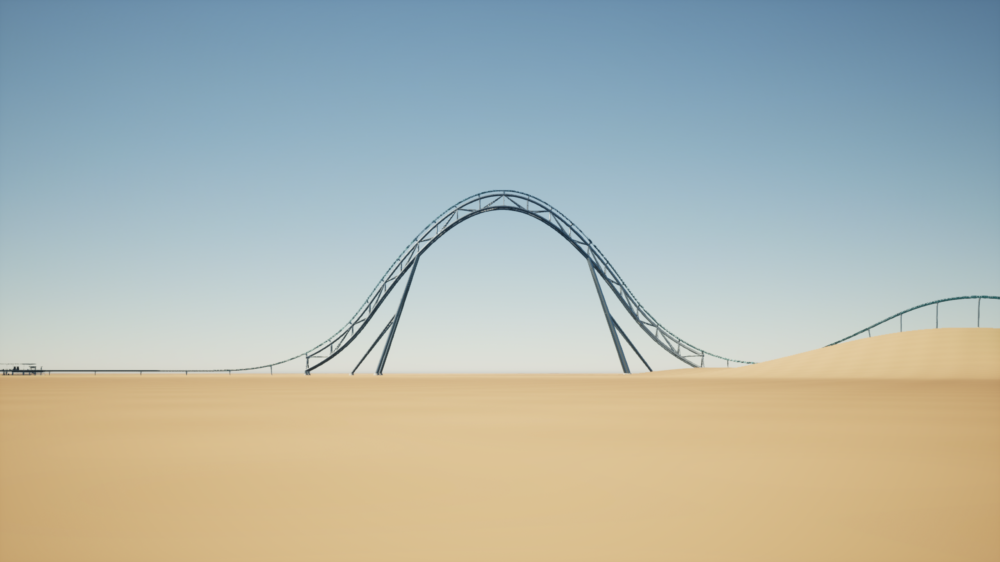
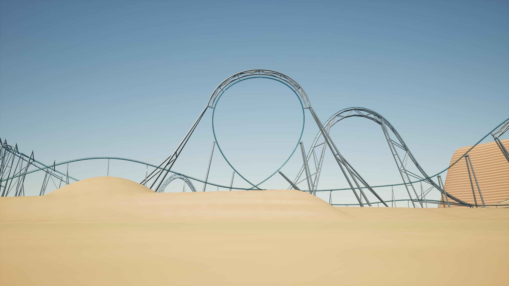
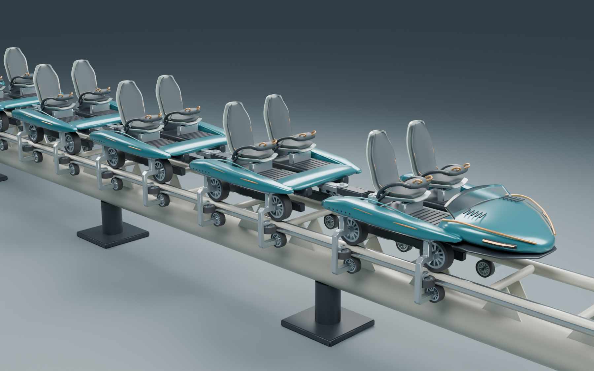
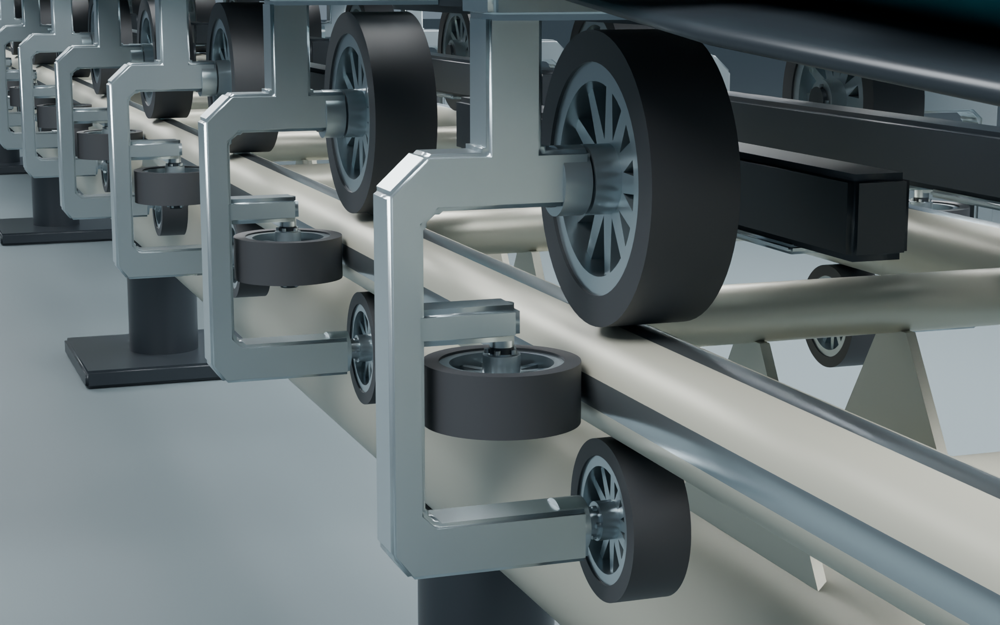
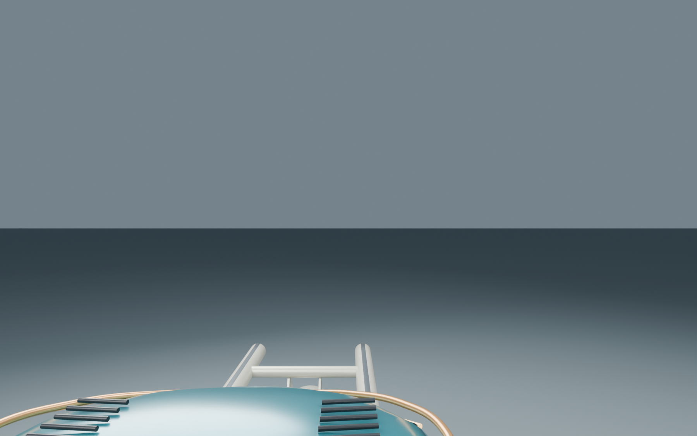

# Current local snapshot for online diagnosis

1 October 2026. Published on `main` at `66000ec`, from the former
`codex/legacy-authoring` branch. See [branch consolidation](BRANCH_CONSOLIDATION.md)
for the ancestry and the separately preserved rewrite.

The user says the current local version is buggy and requested this push so the
online version can understand the flagged issues. This snapshot preserves the
current implementation and diagnostic evidence. It does not fix or approve the
ride, supports or train. Read README.md, HANDOFF.md and docs/CODE_MAP.md first;
the open requirements in HANDOFF.md remain authoritative.

## Flagged issues still open

- Unnatural forces, arbitrary flat resets, stuck pitch/yaw/roll, poor banking,
  missing useful connecting elements and weak overall flow.
- Weak opening and twisted drop; inaccurate Falcon's Flight clifftop and
  180-degree return location/geometry/speed; poor Tormenta loop/Immelmann scaling
  and yaw; poor return after the inversions.
- Misplaced LSM boosts, long deceleration/wait gaps, and illogical trim brakes.
- Weak FVD authoring and FVD/spline transitions; overly conservative or costly
  clearance checks. Diagnose false positives while retaining physical clearance.
- Rider-view obstruction from prior train/coaster art and excessive load time.
  The intentional 0-180 km/h launch in about 1.4 s must be retained.
- Support feedback has rejected branching arms, exposed or short tube ends,
  dense/unattractive lattice and excessive support. The latest adapted structures
  are review proposals. The train's wheel clamps were corrected to the transverse
  YZ plane and reduced after feedback; this does not establish visual approval.

These summarize recorded feedback, not new diagnoses. Investigate actual saved
outputs and traces before deciding on fixes. Do not treat earlier test passes,
art-fit checks or a review render as evidence that these complaints are solved.

## What the online checkout contains

`diagnostics/current/manifest.json` records SHA256 hashes and original local
paths. `default3.vcdesign.gz` contains the exact retained default.3 save (27,009
knots), whose uncompressed SHA256 is
`d48ed31cf62621405ee43a859c3e6e1ea468e405b383217fc7fb3e84895a0cf7`.
`support-adapted.vcdesign.gz` contains the separate Exa/adapted-support review,
with uncompressed SHA256
`c0ff688a014f45a4d88337fc0c01a82a0a70ba1cc692a46edb1d96d4ae624ab7`.
Keep these identities distinct: loading default.3 does not regenerate its
stored supports or automatically adopt the Exa dimensions.

Selected existing views below show the latest review proposals. They are not
new defect captures or a full runtime traversal. The retained receipts describe
30 September checks. `support-tests-2026-09-30.log` is historical verification;
`push-native-checks.log` records the 9/9 focused checks run for this push (180.56 s).
Both bundled saves passed fresh native validation. The full suite and Unreal
build were not rerun for this push; design complaints remain open.

Fresh saved-design validation reports are included as `default3-report.json`
and `support-adapted-report.json`. Their `buildCommit` identifies the pre-push
HEAD; the checks ran on the current working source, which required no rebuilding.
Historical source hashes in receipts describe local Windows bytes and may differ
from Git's normalized LF source files. Snapshot artifact hashes preserve exact
bytes across platforms.

[Front-seat motion plot](diagnostics/current/default3-motion.svg),
[middle-seat plot](diagnostics/current/default3-motion-middle.svg) and
[rear-seat plot](diagnostics/current/default3-motion-rear.svg) are generated from
the fresh default.3 validation trace. They use 60 Hz display data; the reports
contain native-step acceptance extrema. These expose current motion for diagnosis
and do not establish reference fidelity or good ride flow.

The editable train is in `native/art/exports/train/Riftwake-Train.blend` with
its portable GLB alongside it. The development runtime still shows car-position
markers. Source/scripts, track-study FBX and Unreal study assets are included.
Support Blender reviews (up to 886 MB), the generated 70 MB track-study Blend,
backups, bulk renders, build/cache/package/profile directories and historical
archives remain local. Recreate native support geometry from the supplied review
save and authoring scripts. Windows shortcuts and the copied package selector
are identity evidence; an online checkout has no packaged Unreal executable.

## Reproduce the saved state

Restore the supplied saves into the ignored `out/online-diagnosis` directory:

```sh
python docs/diagnostics/restore_saves.py
```

Build the current native sources using CMake (Windows/macOS configuration is in
`.github/workflows/native.yml`). A single-config checkout can use:

```sh
cmake -S native -B native/build-online -DCMAKE_BUILD_TYPE=Release
cmake --build native/build-online --parallel 8
ctest --test-dir native/build-online --output-on-failure --parallel 1 -R '^(support|support_family|support_system|support_fabrication|clearance|track_web|track_profile|structures|terrain)$'
```

Validate and export actual force histories, geometry and hardware intervals:

```sh
native/build-online/coaster_cli validate out/online-diagnosis/default3.vcdesign --json out/online-diagnosis/default3.json --trace out/online-diagnosis/default3-trace.json --plan out/online-diagnosis/default3-plan.json
native/build-online/coaster_cli validate out/online-diagnosis/support-adapted.vcdesign --json out/online-diagnosis/support-adapted.json
python native/tools/render_motion_report.py out/online-diagnosis/default3
native/build-online/support_review out/online-diagnosis/support-meshes out/online-diagnosis/support-adapted.vcdesign --current-supports
```

For multi-config Windows builds, use `--config Release`, `ctest -C Release` and
executables under `native/build-online/Release/*.exe`. `support_review --current-supports`
exports stored support members. `--save-review` explicitly regenerates and
validates a separate review; it must not overwrite the canonical input.

Study front/middle/rear histories and the actual opening, cliff, inversions,
turnaround and return. Read the focused implementation paths in CODE_MAP.md.
On the local Windows machine, `inspect_geometry.ps1` provides the current Unreal
inspection cameras. Source changes have not replaced the frozen package.

## Selected current review views











