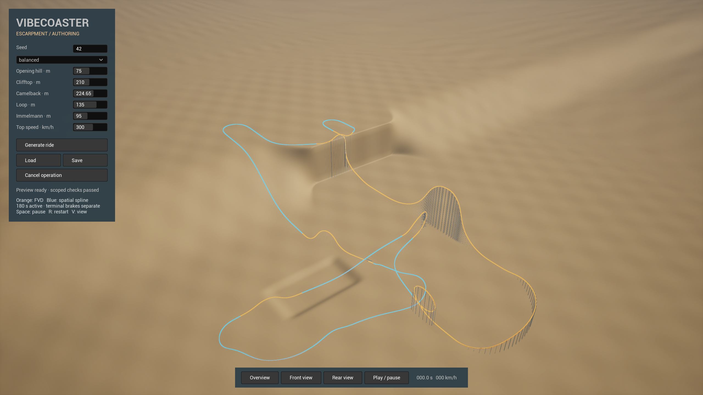

# Verified Windows preview 3.0.0-preview.1

The fresh mixed FVD/spline foundation is packaged, GPU-tested and available through
`Play.cmd`. Package source commit: `89209ae840f3251266cc6f47b69eef9d5ae24e3b`.
The executable SHA-256 is `888AD7A20F9F0DECA67D3C5D538208353083E799F67AC40E9B272F21D6C95F05`.
The [full package manifest](../evidence/package-manifest.json) identifies the
fixture, engine and packaged executable/assets. Windows/macOS native CI passed
for that source: [run 35791234171](https://github.com/Banrs/VibeCoaster2/actions/runs/35791234171).

## Measured performance

| Measurement | Samples | Median | Empirical p99 | Maximum |
|---|---:|---:|---:|---:|
| First load in a fresh process/profile | 300 | 2.286 s | 2.360 s | 2.379 s |
| Second load in that process | 300 | 2.314 s | 2.364 s | 2.401 s |
| Process start to initial UI GPU readiness | 300 | 1.603 s | 1.642 s | 1.652 s |
| Separate continuous loading session | 40 | 2.305 s | Not used for p99 acceptance | 2.375 s |
| Default generation through GPU readiness | 6 | 7.675 s | Not estimated | 7.725 s |

Every timed load completed and exited normally; none reached five seconds.
The first packaged pilot is retained separately: its first load took 2.646 s
and initial UI startup took 3.248 s. The later 300-process series does not erase
that first-launch observation. Earlier editor shader-compilation tails remain in
the development evidence and are not represented as packaged timings.

Tests used an actual 2560x1440 window, 60 FPS, VSync off, Ryzen 9 5900X, RTX 5070 Ti,
driver 32.0.16.1692 and UE 5.8.2 CL56702186 on Windows 11 build 26340. Processes ran
sequentially without concurrent compilation or another benchmark. Timing captures
were disabled; real image, flow and traversal checks ran separately. The displayed
viewport size, material completeness, actual window frames and GPU fence were
checked on each load.

These are empirical nearest-rank p99 results on this host/configuration. Fresh
process/profile does **not** mean cold OS storage or driver caches: caches were
not reset, and identity hashing reads files before launch. With zero exceedances
in 300 independent representative trials, the one-sided 95% binomial upper bound
is 0.9936% for each category separately; independence and representativeness are
assumptions, not a guarantee for other workloads or hardware.

Escarpment's six fresh-process generation samples used the same display settings
and nominal seed/site intent. Its median was 31.630 s to its earlier scene-commit
marker, versus 7.675 s through the rewrite's actual GPU readiness: **75.7% lower**,
meeting the <=16 s and >=40% improvement targets. The rides differ: Escarpment was
8,756.7 m / 201.27 s; this rewrite is 8,311.0 m / 191.94 s. Endpoint and geometry
differences are explicit; the comparison does not claim identical implementations.

[All statistics and samples](../evidence/packaged-performance.json),
[raw timing events](../evidence/packaged-tail-events.jsonl) and
[per-process identities](../evidence/packaged-tail-identities.jsonl) are retained.
The archived 20–30 s saved-load complaint was not reproduced: preserved logs show
a 25.204 s generation event, and the old saved-load probe took about 3.992 s to
scene commit. No unproven diagnosis of that historical complaint is claimed.

## Functional and visual checks

Both packaged front/rear passes completed the entire 191.940625 s ride in real
time with over 11,000 rendered frames each and all 30 requested captures.
The overview, opening, cliff-side action, high crest, ravine, station return and
rear-car view were visually inspected. The assets remain a simulation preview;
detailed art is deferred.

The packaged runtime flow passed seed-77/intense generation, save/reload and
control restoration, cancellation during CPU work/upload/GPU handoff, and corrupt
save rejection. The previous ride remained visible and continued playing/rendering.
These are integration tests through the real runtime handlers, not manual mouse tests.

`Play.cmd -Verify` checked the promoted manifest and payload, then exercised the
normal user-save/default fallback. It loaded through actual GPU readiness in
2.284 s and exited 0. Play uses a 1600x900 window with the same 60 FPS/VSync-off
policy; the timing series used the larger 2560x1440 viewport. Its exact
[launcher/executable identity](../evidence/play-identity.json) and
[events](../evidence/play-events.jsonl) are retained.

The first packaged build exposed an editor-only diagnostic call. That dependency
was removed and both game/editor targets rebuilt before committing the fix.
Cook-generated file-order logs are narrowly ignored so clean-source package
identity checks do not mistake generated logs for source changes.

## Explicit scope

The lower-park station, purposeful ascent, protected camelback and fixed ravine
route are retained. All nine recipe cases pass fresh nominal, full, lower-drag,
separate temporal/spatial and combined refinement checks. Existing force-history,
rate and clearance thresholds were not weakened. Drive commands resolve onto
spatially engaged reaction points, with required force, power and work reported.

Upright restraint/backrest/headrest applicability and the six-car 9,000 kg model
remain assumptions. Detailed motor/brake solids, equipment ratings, contact,
coupler/structural strength, full parameter-space feasibility and whole-standard
certification remain unclaimed. Full GUI layout editing, detailed art and VR are
later work. macOS native CI passes; macOS UE packaging/GPU testing was not performed.

